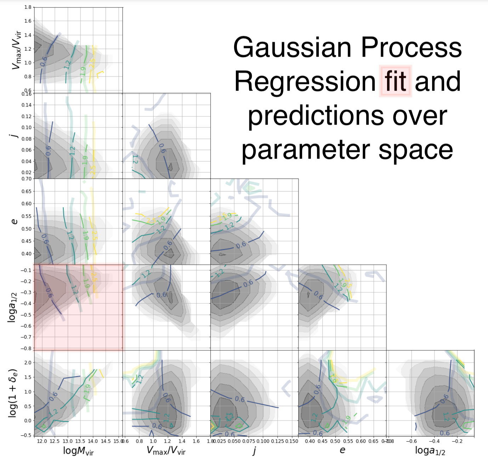
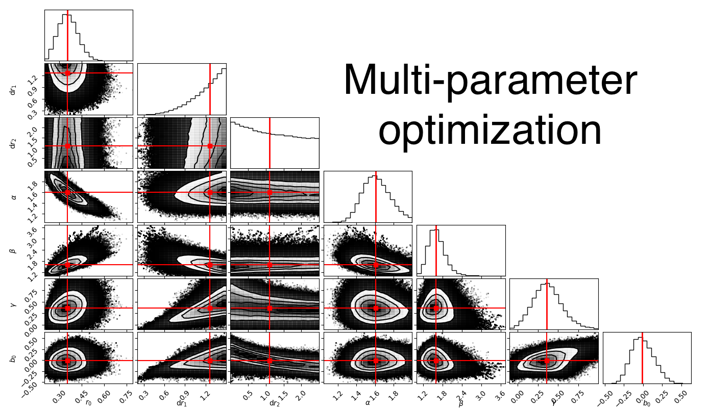

# Matthew Fong — Data Science Portfolio

[](https://www.python.org/)
[](https://scikit-learn.org/)
[](https://emcee.readthedocs.io/)
[](https://github.com/mfong955/AstrophysicsResearchExamples)

## 🎯 About

PhD physicist turned data scientist with 7+ years of Python experience, specializing in **Bayesian inference**, **Gaussian Process Regression**, and **large-scale statistical modeling**. I've processed 8+ billion data points in my research and published 4 first-author papers applying advanced ML/statistics to complex real-world problems. Currently an AI/ML Technical Writer at AWS.

> **📝 Note:** I used AI to reorganize this portfolio for clarity. All original code is mine, written before AI coding assistants existed.
> - **Quick overview:** Browse the [Featured Projects](#-featured-projects) below
> - **Verify my skills:** Check [`research-archive/`](./research-archive/) for my original code
> - **See the mapping:** [`CODE_MAPPING.md`](./CODE_MAPPING.md) shows which original files demonstrate each technique

## 🛠️ Core Competencies

| Category | Skills |
|----------|--------|
| **Machine Learning** | Gaussian Process Regression, MCMC Sampling, Bayesian Optimization, Multi-parameter Optimization, Uncertainty Quantification |
| **Statistical Methods** | Bayesian Inference, Covariance Matrix Analysis, Hypothesis Testing, Confidence Intervals, Maximum Likelihood Estimation |
| **Data Engineering** | Large-scale Data Processing (8B+ points), Parallel Computing, HDF5/NumPy Data Pipelines, ETL Workflows |
| **Tools & Frameworks** | Python, NumPy, SciPy, Scikit-learn, emcee, Matplotlib, Pandas, Jupyter, Docker |

## 📂 Featured Projects

### 1. [Bayesian Parameter Estimation with MCMC](./bayesian-inference/)
> **Multi-parameter optimization using Markov Chain Monte Carlo sampling with uncertainty quantification**

| Aspect | Details |
|--------|---------|
| **Problem** | Estimate 7 model parameters simultaneously from noisy observational data with correlated uncertainties |
| **Approach** | Custom MCMC implementation using emcee with parallel processing, flat priors, and full covariance matrix handling |
| **Scale** | 50,000+ MCMC steps, 72+ parallel walkers, processing millions of data points |
| **Results** | Achieved robust parameter estimates with full posterior distributions and uncertainty quantification |
| **Key Skills** | `bayesian-inference` `mcmc` `parallel-processing` `uncertainty-quantification` `python` |

---

### 2. [Gaussian Process Regression for Multi-dimensional Interpolation](./gaussian-process-regression/)
> **Non-linear relationship modeling across multi-parameter spaces with uncertainty estimates**

| Aspect | Details |
|--------|---------|
| **Problem** | Model complex non-linear relationships across 6+ dimensional parameter space |
| **Approach** | Scikit-learn GPR with custom kernels (Matern, RBF, RationalQuadratic), hyperparameter optimization |
| **Scale** | 100x100 prediction grids, 10,000+ training samples |
| **Results** | Smooth interpolation with uncertainty bounds, enabling prediction at any point in parameter space |
| **Key Skills** | `gaussian-process` `scikit-learn` `interpolation` `uncertainty-quantification` `visualization` |

---

### 3. [Statistical Model Fitting with Covariance Matrices](./statistical-modeling/)
> **Rigorous model fitting to noisy data with full error propagation**

| Aspect | Details |
|--------|---------|
| **Problem** | Fit parametric models to observational data with correlated measurement uncertainties |
| **Approach** | Curve fitting with full covariance matrices, positive-definiteness validation, inverse covariance weighting |
| **Scale** | Multiple datasets with 25+ correlated measurements each |
| **Results** | Statistically robust fits with proper error propagation and model validation |
| **Key Skills** | `curve-fitting` `covariance-analysis` `scipy` `model-validation` `statistics` |

---

### 4. [Large-scale Data Processing Pipeline](./large-scale-data/)
> **Efficient processing of billions of data points using parallel computing**

| Aspect | Details |
|--------|---------|
| **Problem** | Process and analyze 8+ billion particle positions from large-scale simulations |
| **Approach** | NumPy vectorization, multiprocessing pools, efficient binning algorithms, HDF5 data storage |
| **Scale** | 8+ billion data points, terabytes of raw data |
| **Results** | Reduced processing time from days to hours through optimized algorithms |
| **Key Skills** | `big-data` `parallel-processing` `numpy` `hdf5` `optimization` |

---

### 5. [Data Visualizations](./visualizations/)
> **Publication-quality visualizations demonstrating complex data analysis**

| Aspect | Details |
|--------|---------|
| **Problem** | Communicate complex statistical and ML results clearly to stakeholders |
| **Approach** | matplotlib, seaborn, corner plots with publication-ready formatting |
| **Scale** | Multi-panel figures, uncertainty visualization, model diagnostics |
| **Results** | Publication-quality figures used in peer-reviewed papers |
| **Key Skills** | `matplotlib` `data-visualization` `scientific-plotting` `uncertainty-visualization` |

---

## 📊 Sample Outputs

### Gaussian Process Regression on Multi-parameter Space

*Gaussian Process Regression fitted across multi-dimensional parameter space, demonstrating uncertainty quantification and non-linear relationship modeling. This technique is widely used in Bayesian optimization, A/B testing analysis, and predictive modeling where uncertainty estimates are critical.*

### Multi-parameter MCMC Optimization

*Multi-parameter optimization results showing convergence of 7 simultaneous parameters using MCMC sampling. Demonstrates expertise in high-dimensional optimization commonly used in hyperparameter tuning and model calibration.*

### Statistical Model Fitting

*Model fitting to observational data with full covariance matrix handling. Shows rigorous statistical methodology for fitting models to noisy real-world data with correlated uncertainties.*

---

## 📁 Repository Structure

```
├── bayesian-inference/          # MCMC and Bayesian parameter estimation
├── gaussian-process-regression/ # GPR for multi-dimensional interpolation
├── statistical-modeling/        # Covariance-weighted model fitting
├── large-scale-data/           # Parallel processing for big data
├── visualizations/             # Publication-quality figures
├── publications/               # First-author research papers (PDFs)
├── research-archive/           # Original research code (reference)
└── CODE_MAPPING.md             # Maps original code → portfolio examples
```

📋 **[CODE_MAPPING.md](./CODE_MAPPING.md)** — See which original research files each portfolio project was derived from, including detailed technique extraction.

---

## 📄 Publications & Research

- **4 First-Author Publications** in peer-reviewed astrophysics journals
- Research applying Bayesian inference and statistical modeling to large-scale datasets
- Developed novel methods for uncertainty quantification in noisy measurements
- [Google Scholar Profile](https://scholar.google.com/citations?user=YOUR_ID)

---

## 🎓 Education & Experience

| Role | Organization | Period |
|------|--------------|--------|
| AI/ML Technical Writer | Amazon Web Services | Current |
| Postdoctoral Research Fellow | Shanghai Jiao Tong University | 2019-2022 |
| PhD in Physics | University of Texas at Dallas | 2019 |

---

## 🔗 Connect

- **LinkedIn**: [linkedin.com/in/matthewfong](https://linkedin.com/in/matthewfong)
- **GitHub**: [github.com/mfong955](https://github.com/mfong955)
- **Email**: [your.email@example.com](mailto:your.email@example.com)

---

*This portfolio demonstrates transferable data science skills developed through 7+ years of quantitative research. All code examples are production-ready implementations of industry-relevant techniques.*
